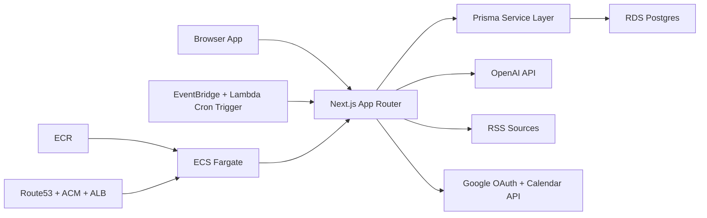

# Lloyd's Coffee House Architecture

## 1) Product Thesis
Lloyd's Coffee House is an AI-mediated salon for high-agency thinkers who want to produce real-world impact. The product has two primary functions:

1. Curated long-form intelligence feed (AI/philosophy/rationalist/engineering).
2. High-signal human matching for conversations (virtual and in-person).

A manifesto gate is mandatory before any product use.

## 2) Core Principles
- Quality over volume: no karma and no popularity game loops.
- Identity with depth: profiles emphasize ideas, goals, and thinking trajectories.
- Agency filter: manifesto consent is required and intentional.
- AI as amplifier, not replacement: AI summarizes, ranks, and suggests; humans decide.
- Privacy and safety by default: minimize exposure of personal metadata and meeting details.

## 3) Technology Stack (Scalable + AWS-Native)
- Frontend + API: Next.js 16 App Router, React 19, TypeScript.
- Styling: Tailwind CSS 4 + bespoke CSS variables and typography system.
- Database: PostgreSQL (AWS RDS/Aurora) with Prisma ORM.
- Auth: Auth.js (NextAuth v5) with Google/GitHub OAuth.
- AI: OpenAI API for article summaries and match rationale/scoring.
- Compute: AWS ECS Fargate behind an Application Load Balancer.
- Container registry: AWS ECR.
- Jobs/Scheduling: AWS EventBridge schedules invoking a Lambda trigger for authenticated job routes.
- Feeds: RSS ingestion via server-side parser + dedupe + canonicalization.
- Calendar integration: Google Calendar (free/busy + event insertion).
- Observability: CloudWatch Logs + metrics (future: X-Ray/OpenTelemetry + Sentry).

## 4) High-Level Components

## 5) Domain Model (Current + Planned)
### Identity and Onboarding
- `User`: auth identity + profile text fields + manifesto acceptance timestamp.
- `Account`, `Session`, `VerificationToken`: Auth.js adapter tables.

### Feed and Content
- `FeedSource`: curated/global/user-linked RSS source registry.
- `Post`: normalized item metadata, submission channel, summary status, summary bullets.
- Optional future:
  - `PostTag`
  - `ModerationEvent`
  - `PostQualitySignal`

### Matching and Scheduling
- `Availability`: user-provided windows, mode, optional location.
- `Match`: paired users + overlap slot + rationale + calendar event IDs.
- Optional future:
  - `ConversationFeedback`
  - `TrustSignal`
  - `MeetingOutcome`

## 6) Product Surfaces
1. Manifesto gate (blocking).
2. Feed home (AI summaries first, then article links).
3. Post submission (anonymized in UI).
4. Profile editor (deep free-form identity + blog feed URL).
5. Matching page (availability + locations + generated matches).

## 7) Critical Flows
### 7.1 Manifesto Flow
- Visitor sees manifesto first.
- User signs in.
- User must explicitly agree.
- Access to feed/profile/matching unlocked only after agreement.

### 7.2 Feed Ingestion + Summarization
1. Cron runs RSS ingest job.
2. New items are deduped by canonical URL and inserted as pending summaries.
3. Summary job extracts article text and calls OpenAI.
4. Summary bullets + estimated read seconds are stored.
5. Feed ranks by recency + source quality + freshness.

### 7.3 User Submission Flow
1. Authenticated accepted user submits title/url/optional notes.
2. Post stored with anonymous display policy.
3. Summary job processes submission identically to RSS posts.

### 7.4 Matching + Calendar Flow
1. Users publish availability windows and optional locations.
2. Matching job computes overlap and compatibility.
3. If compatible, match record is created with rationale.
4. If both users have calendar authorization, create calendar events automatically.

## 8) AI Responsibilities
- Summarization: concise bullets designed for ~10-30 second scan.
- Matching: compatibility rationale from profile text, goals, and overlap context.
- Future:
  - profile topic extraction from linked blogs,
  - content quality triage,
  - abuse/spam anomaly scoring.

## 9) Security, Privacy, and Abuse Controls
- Manifesto enforcement in server-side guards.
- Role-free MVP but designed for future moderator/admin scopes.
- Sensitive fields (calendar tokens) handled server-side only.
- Rate limiting for submission and job endpoints.
- Signed/secret-protected cron routes.
- Basic anti-spam heuristics now; robust moderation pipeline in phase 2.

## 10) Scalability Strategy
- Stateless app tier with database-backed state.
- Background jobs via scheduled endpoints and batched processing.
- Idempotent ingest/summarize/match operations.
- Key indexes:
  - `Post(canonicalUrl)` unique
  - `Post(publishedAt)`
  - `Post(summaryStatus)`
  - `Availability(isMatched, startsAt)`
  - `Match(createdAt)`
- Future upgrades:
  - dedicated queue (SQS),
  - read replicas,
  - vector search for semantic recommendations,
  - caching layer for hot feed windows.

## 11) Missing-but-Required Considerations (Planned)
- Policy/legal:
  - Terms, privacy policy, meeting liability disclaimers.
  - Content licensing compliance for scraped summaries.
- Trust and safety:
  - abuse reporting, blocking, moderation actions.
- Data governance:
  - retention periods for calendar and match metadata.
  - user data export/delete workflows.
- Community design:
  - quality standards and explicit anti-extractive behavioral rules.
- Experimentation:
  - ranking experiments and matching quality telemetry.

## 12) Deployment Topology
- AWS ECS Fargate service per environment (`staging`, `production`).
- AWS ECR repositories for container images.
- Route 53 + ACM + ALB for TLS and routing.
- Secrets Manager for runtime secrets and key material.
- EventBridge + Lambda for scheduled ingestion/summarization/matching jobs.
- Domains:
  - Staging: `cafestaging.bolte.cc`
  - Production: `cafe.bolte.cc`
- CI/CD: GitHub Actions pushing images to ECR and rolling ECS services.

## 13) Definition of Done for MVP
- Auth + manifesto gating functional.
- Feed shows RSS + user-submitted posts with AI summaries.
- No karma and no submitter attribution in feed UI.
- Profile includes long-form text and blog feed URL.
- Availability capture and match generation functional.
- Calendar event creation functional for connected Google users.

## 14) Post-MVP Roadmap
1. Recommendation quality model + personalized feed ranking.
2. Conversation quality feedback loop + iterative matching improvement.
3. Safety tools: reporting, blocklists, moderator dashboard.
4. Knowledge graph over profiles/posts/blogs for richer introductions.
