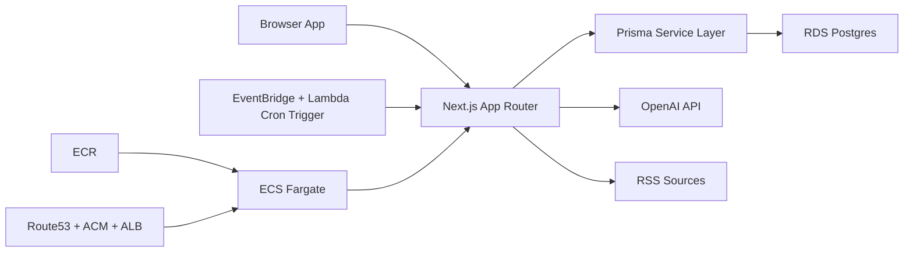

# Lloyd's Coffee House Architecture

## 1) Product Thesis
Lloyd's Coffee House is an AI-mediated salon for high-agency thinkers who want substantive, high-signal discussion around long-form writing.

Core product surfaces:
1. Public curated intelligence feed (any visitor can read).
2. Authenticated commenting with constitutional moderation.
3. Member profile editor for context and identity depth.

## 2) Core Principles
- Quality over volume: no karma and no popularity game loops.
- Identity with depth: profiles emphasize ideas, goals, and thinking trajectories.
- Public reading, gated participation: feed is open; commenting requires authentication and standards acceptance.
- AI as amplifier, not replacement: AI summarizes, ranks, and moderates; humans decide.
- Privacy and safety by default: moderation and sensitive account state remain server-side.

## 3) Technology Stack (Scalable + AWS-Native)
- Frontend + API: Next.js 16 App Router, React 19, TypeScript.
- Styling: Tailwind CSS 4 + bespoke CSS variables and typography system.
- Database: PostgreSQL (AWS RDS/Aurora) with Prisma ORM.
- Auth: Auth.js (NextAuth v5) with Google/GitHub OAuth.
- AI: OpenAI API for article summaries, quality ratings, and comment moderation.
- Compute: AWS ECS Fargate behind an Application Load Balancer.
- Container registry: AWS ECR.
- Jobs/Scheduling: AWS EventBridge schedules invoking a Lambda trigger for authenticated job routes.
- Feeds: RSS ingestion via server-side parser + dedupe + canonicalization.
- Observability: CloudWatch Logs + metrics (future: X-Ray/OpenTelemetry + Sentry).

## 4) High-Level Components

## 5) Domain Model
### Identity and Onboarding
- `User`: auth identity + profile text fields + manifesto acceptance timestamp.
- `Account`, `Session`, `VerificationToken`: Auth.js adapter tables.

### Feed and Content
- `FeedSource`: curated RSS source registry.
- `Post`: normalized item metadata, submission channel, summary status, summary bullets.
- `PostComment`: user-authored comments linked to feed posts.
- `PostCommentEdge`: DAG edges for multi-parent comment threading.
- `CommentModerationEvent`: moderation and penalty audit trail.
- `JobRun`: execution tracking for background jobs.

## 6) Product Surfaces
1. Feed home at `/` (public).
2. Manifesto gate for authenticated users before protected actions.
3. Post comments (`/feed/[postId]/comments`) gated to authenticated, manifesto-accepted users.
4. Profile editor for accepted members.

## 7) Critical Flows
### 7.1 Public Feed + Authenticated Commenting
1. Any visitor can load `/` and browse ranked posts.
2. Comment links route to protected comment pages.
3. Unauthenticated visitors are redirected to `/` with a `next` param.
4. Authenticated users without manifesto acceptance are redirected to `/manifesto`.
5. Accepted users can read/write comments.

### 7.2 Feed Ingestion + Summarization
1. Cron runs RSS ingest job.
2. New items are deduped by canonical URL and inserted as pending summaries.
3. Summary job extracts article text and calls OpenAI.
4. Summary bullets + estimated read seconds are stored.
5. Feed ranks by quality and recency heuristics.

### 7.3 Profile Flow
1. Accepted user edits profile fields (headline, bio, interests, goals, ideas in flight).
2. Profile updates are persisted and revalidated for UI reads.

## 8) AI Responsibilities
- Summarization: concise bullets designed for ~10-30 second scan.
- Quality rating: constitution-constrained quality labels and rationale.
- Comment moderation: constitutional compliance decisioning with escalating penalties.

## 9) Security, Privacy, and Abuse Controls
- Protected routes enforced in middleware + server-side guards.
- Manifesto acceptance required before profile/comment access.
- Account ban and suspension enforcement centralized in auth guards and moderation.
- Secret-protected cron routes.
- Basic anti-spam heuristics now; robust moderation tooling remains future work.

## 10) Scalability Strategy
- Stateless app tier with database-backed state.
- Background jobs via scheduled endpoints and batched processing.
- Idempotent ingest/summarize operations.
- Key indexes:
  - `Post(canonicalUrl)` unique
  - `Post(publishedAt)`
  - `Post(summaryStatus)`
  - `Post(qualityRating, createdAt)`
- Future upgrades:
  - dedicated queue (SQS),
  - read replicas,
  - caching layer for hot feed windows.

## 11) Missing-but-Required Considerations (Planned)
- Policy/legal:
  - Terms, privacy policy, and moderation disclosure language.
  - Content licensing compliance for scraped summaries.
- Trust and safety:
  - abuse reporting, blocking, moderator workflows.
- Data governance:
  - retention periods for moderation metadata.
  - user data export/delete workflows.
- Community design:
  - explicit anti-extractive behavioral rules.
- Experimentation:
  - ranking experiments and moderation quality telemetry.

## 12) Deployment Topology
- AWS ECS Fargate service per environment (`staging`, `production`).
- AWS ECR repositories for container images.
- Route 53 + ACM + ALB for TLS and routing.
- Secrets Manager for runtime secrets and key material.
- EventBridge + Lambda for scheduled ingestion/summarization jobs.
- Domains:
  - Staging: `cafestaging.bolte.cc`
  - Production: `cafe.bolte.cc`
- CI/CD: GitHub Actions pushing images to ECR and rolling ECS services.

## 13) Definition of Done for MVP
- Auth + manifesto gating functional for protected interactions.
- Feed is public and shows curated/user-submitted posts with AI summaries.
- Comment pages are authentication-gated and moderation-enforced.
- No karma and no submitter attribution in feed UI.
- Profile editing functional for accepted members.

## 14) Post-MVP Roadmap
1. Recommendation quality model + personalized feed ranking.
2. Safety tools: reporting, blocklists, moderator dashboard.
3. Knowledge graph over profiles/posts for richer context.
